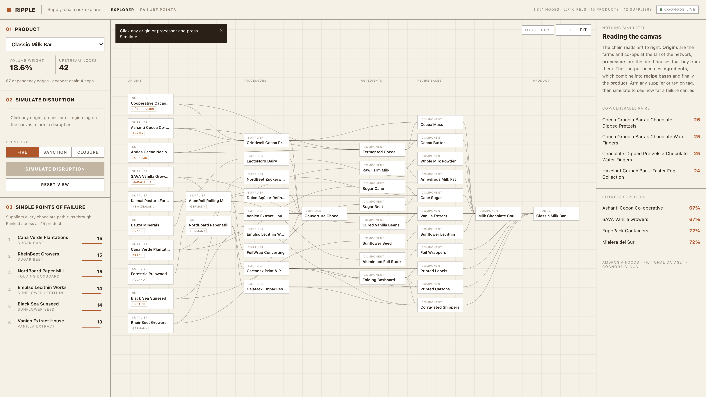
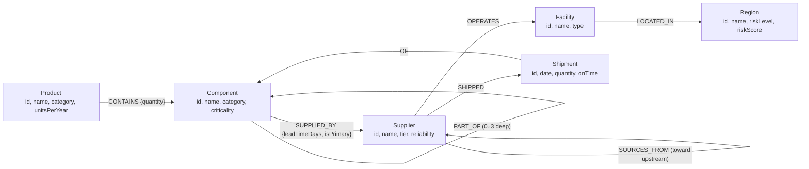
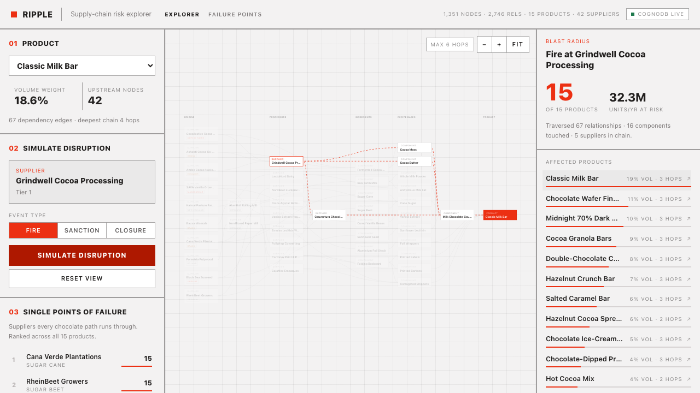
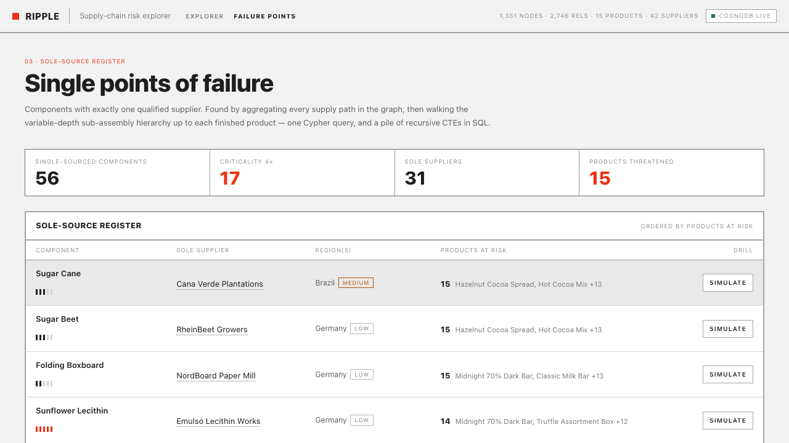
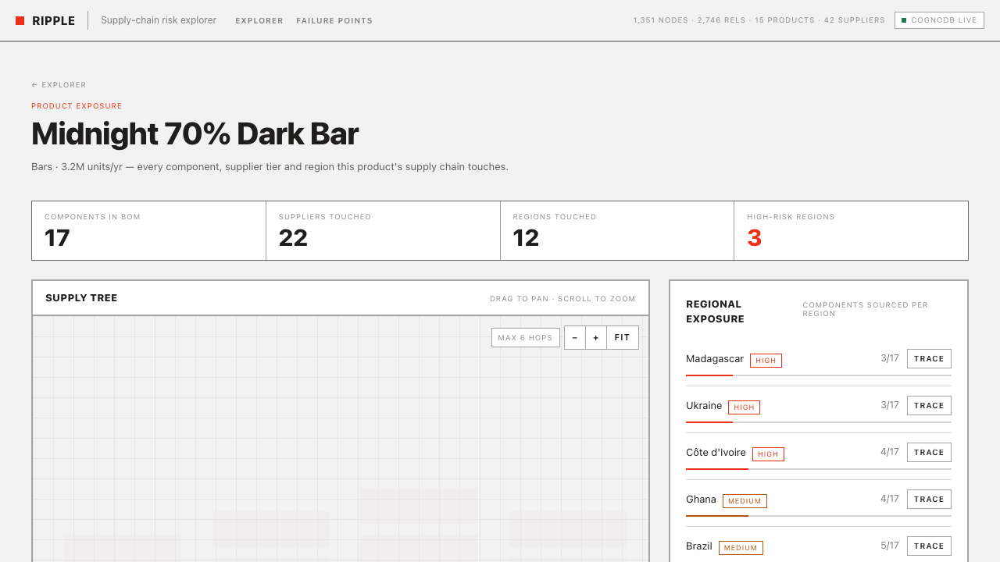

# Ripple — Supply-chain risk explorer

**Live demo: [graph-application.vercel.app](https://graph-application.vercel.app/)**

A graph-powered supply-chain risk explorer built on **CognoDB Cloud** (openCypher over Bolt, official Neo4j drivers). It models a fictional chocolate & snack maker — *Ambrosia Foods* — and its multi-tier supply chain, and answers the question every operations team dreads:

> **"If this factory, supplier, or region goes down — which products stop shipping, how does the damage propagate, and where are our hidden single points of failure?"**



## Why a graph database?

Supply chains are graphs, not tables. This app leans on four things a relational schema fights you on:

1. **Variable-depth traversal.** A product contains sub-assemblies, which contain components, which are made by tier-1 suppliers, who source from tier-2 and tier-3 suppliers. The depth differs per branch and per product. In SQL this is a recursive CTE per edge type, unioned and depth-capped by hand. In Cypher it's a pattern:

   ```cypher
   (d:Supplier)<-[:SOURCES_FROM*0..4]-(:Supplier)<-[:SUPPLIED_BY]-(:Component)
               -[:PART_OF*0..3]->(:Component)<-[:CONTAINS]-(p:Product)
   ```

2. **Reverse blast-radius analysis.** "Everything downstream of this node" is the same traversal run from an arbitrary anchor (a supplier, a factory, or an entire region). One parameterized query powers the whole Disruption Simulator.

3. **Path explanations.** *Why* is the Midnight 70% Dark Bar exposed to Côte d'Ivoire? `shortestPath` returns the actual chain — dark couverture → chocolate works → Grindwell cocoa processing → Ivoire co-operative → San-Pédro drying station → Côte d'Ivoire — which the UI renders as a readable trace. SQL gives you a boolean; the graph gives you the story.

4. **Whole-graph structural queries.** The single-point-of-failure report aggregates supply paths across *all* components and walks each one up to every affected product. It's one Cypher query; the relational equivalent is a pile of recursive CTEs joined against aggregates.

The relationships aren't foreign keys to join through — they're the *subject matter*.

## Data model



Seeded scale: **15 products, 60 components (recipe intermediates nested up to three levels deep), 42 suppliers across 3 tiers, 48 facilities, 16 regions, 1,170 shipments — ≈1,343 nodes / 2,746 relationships.** The dataset deliberately encodes risk stories that echo real confectionery shocks: Grindwell, the sole cocoa processor, whose failure halts all 15 products; Madagascar vanilla, one cyclone-exposed origin feeding an extract that sits in nearly every recipe; a single Ukrainian sunseed crusher feeding both the sunflower oil refiner and the lecithin works that every couverture depends on; sole-origin Giresun hazelnuts behind the praline line; and a handful of dual-sourced components (cane vs. beet sugar, Polish vs. Mexican cartons, three cocoa origins) so mitigation queries have real answers.

## The showcase queries

All Cypher lives in [`lib/queries.ts`](lib/queries.ts) and runs through the official `neo4j-driver` with **`$parameters` only — no string-concatenated Cypher anywhere**. Highlights:

| # | Query | Graph feature it leans on |
|---|-------|---------------------------|
| 1 | **Blast radius** (`blastRadius`) — disrupted supplier/facility/region → every impacted product with hop distance and the full propagation subgraph | Multi-hop, variable-length traversal (up to 9 hops region→product) |
| 2 | **Single points of failure** (`spofReport`) — components with exactly one qualified supplier, ranked by products threatened | Whole-graph aggregation + variable-depth rollup — the "awkward in SQL" query |
| 3 | **Exposure trace** (`exposurePath`) — shortest explanation of *why* a product touches a supplier/region | `shortestPath` over heterogeneous edge types |
| 4 | **Co-vulnerability** (`coVulnerablePairs`) — product pairs ranked by shared upstream suppliers | Diamond-pattern matching through shared nodes |
| 5 | **Regional exposure** (`regionExposure`) — % of a product's BOM transitively touching each region | Traversal + per-region aggregation |

Supporting queries: supplier on-time rates from shipment history, product fleet rollups, disruption-target catalog.

## The app

| Screen | What it does |
|--------|--------------|
| **Explorer** (`/`) | The whole console on one screen: pick a product, read its supply chain on a **layered left-to-right canvas** (origins → processors → ingredients → recipe bases → product), click any supplier or region tag to arm a disruption, choose an event type (fire / sanction / closure) and simulate. The canvas dims to the blast radius with animated red impact paths; the right rail reports products hit, volume at risk, per-product hop distance and qualified second sources. Results persist while you switch products to inspect how each one is hit. Deep-linkable (`/?arm=supplier:s-grindwell`) |
| **Failure points** (`/spof`) | The sole-source register: every single-sourced component, its sole supplier, region risk, and products at risk — each row drills straight into the simulator |
| **Product detail** (`/product/[id]`) | Read-only supply-tree canvas, regional exposure bars, and click-to-trace shortest exposure paths |





## Getting started

### 1. Create a CognoDB Cloud instance

1. Sign up at [console.cognodb.com/signup](https://console.cognodb.com/signup) (free tier, no credit card).
2. Create a free **c0** instance and pick a region — it provisions in under a minute.
3. **Copy the connection URI and generated password immediately** — the password is shown exactly once.

### 2. Configure and run

```bash
git clone <this-repo>
cd ripple
npm install

cp .env.example .env.local     # then paste your credentials:
# NEO4J_URI=bolt+s://<instance-id>.databases.cognodb.cloud
# NEO4J_USERNAME=cognodb
# NEO4J_PASSWORD=<your-password>

npm run seed                   # constraints, indexes, full dataset (idempotent — safe to re-run)
npm run dev                    # http://localhost:3000
```

`scripts/verify-queries.ts` (`npx tsx scripts/verify-queries.ts`) smoke-tests every showcase query against your live instance.

## Engineering notes

- **Structure** — `lib/db.ts` (driver singleton, typed read/write helpers, health check) → `lib/queries.ts` (every Cypher statement, parameterized, typed result mappers) → thin route handlers (`app/api/*`) and server components → presentational components. No query strings outside `lib/queries.ts`.
- **The canvas is hand-rolled SVG**, not a graph library: a longest-path layered layout (`lib/canvas-layout.ts`), pointer-pan/wheel-zoom, hover adjacency highlighting, and CSS-animated impact paths — ~500 lines we can defend end to end, with keyboard/AT-accessible node cards.
- **Failure handling** — connectivity errors map to a typed `DbUnreachableError`; every page and API route degrades to an explicit "database unreachable" state with retry instead of crashing. A live DB-link indicator polls `/api/health`.
- **Free-tier respect** — connection pool capped at 20, every variable-length pattern is depth-bounded (`*0..3`, `*0..4`), traversal queries carry `LIMIT`s, and all lookups hit uniqueness constraints/indexes created by the seed script.
- **Determinism** — the seed is `MERGE`-based and uses a seeded PRNG for shipment history: re-running produces the identical graph, no duplicates.
- **CognoDB compatibility** — two engine quirks discovered and worked around, documented in code: temporal `date()` values aren't storable (dates persist as ISO strings), and multi-leg pattern paths only retain their final leg (multi-leg traversals bind one path variable per leg and re-stitch client-side).

## Stack

Next.js 16 (App Router) · TypeScript · Tailwind CSS v4 · official [`neo4j-driver`](https://www.npmjs.com/package/neo4j-driver) v6 · react-force-graph-2d · CognoDB Cloud (free c0) · Vercel
